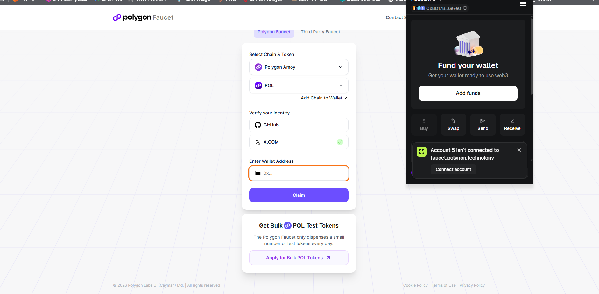
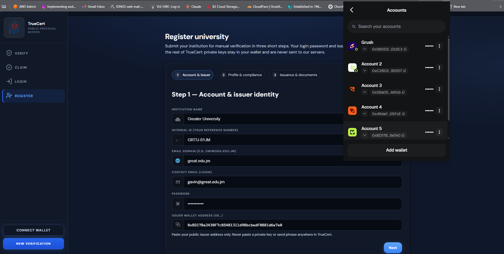
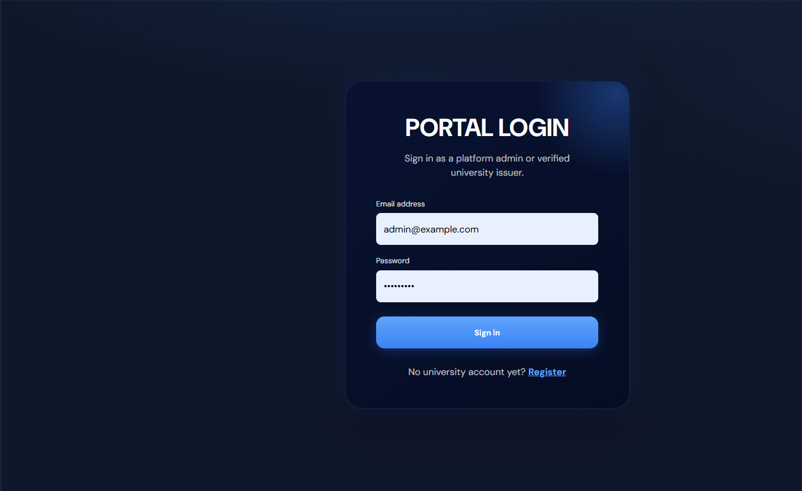
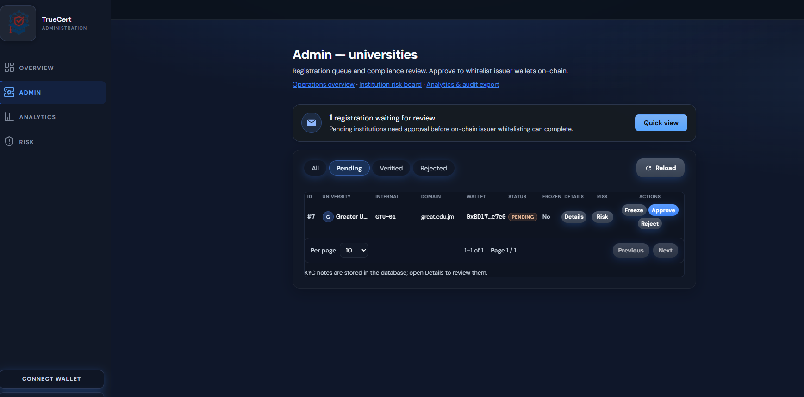
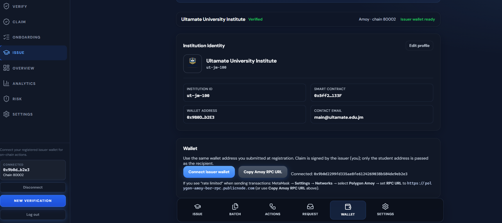
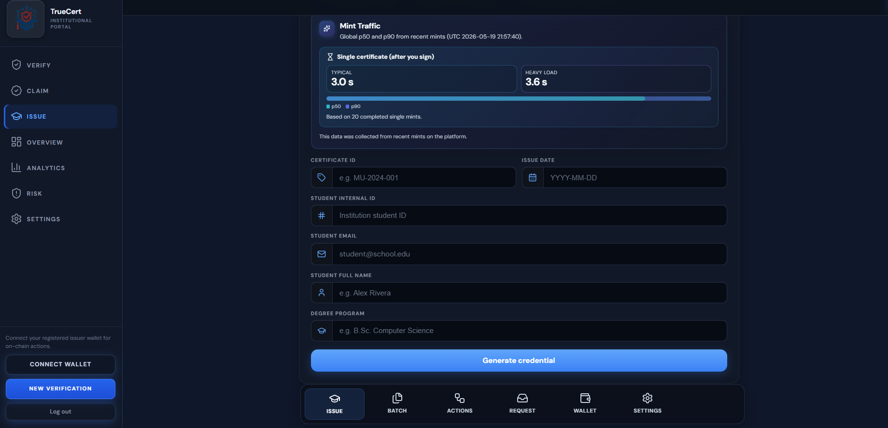
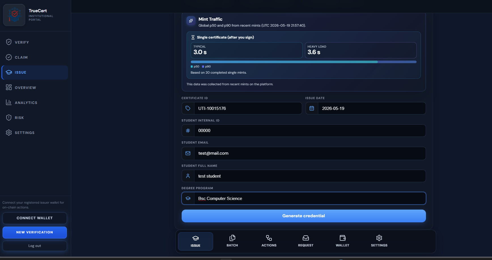
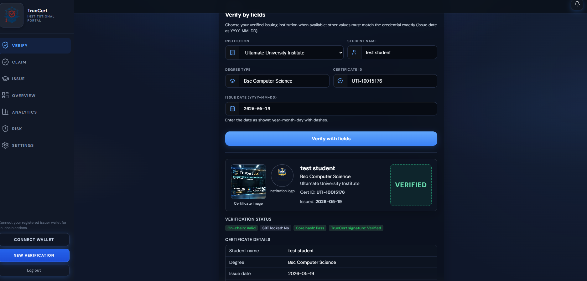
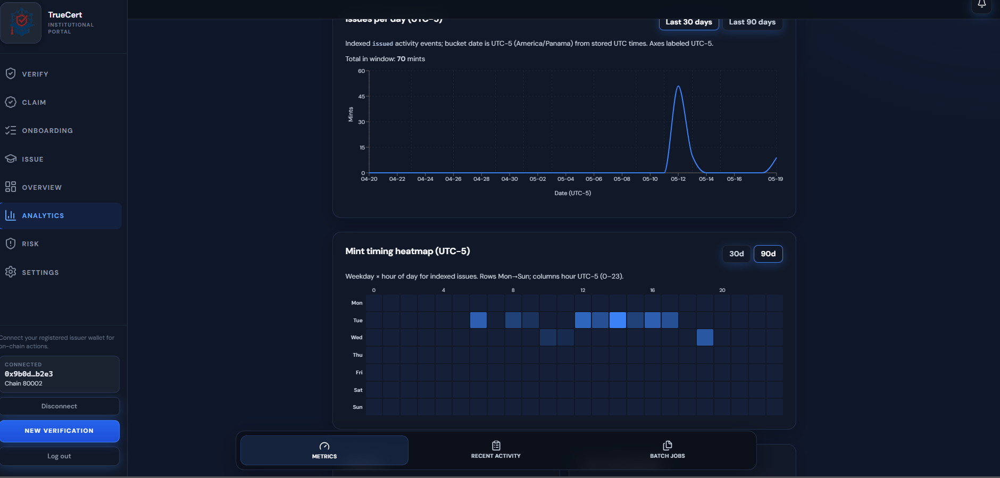

# TrueCert (COMP 3901 capstone)
## Team Members
- Gavin Seaton 
- Samantha Samuels 
- Shantay Kellyman
### Project Supervisor
- Prof. Daniel N. Coore
## Project Scope
Blockchain-based academic credential verification on **Polygon Amoy** with **Flask + Serverless Database**, **Interplanetary File System (IPFS)**, and a **React university portal**. **Blockchain mints that ** use a platform **minter hot wallet** (`mintForIssuer`) after the university signs an **EIP-712 authorization**. The NFT token lifecycle are **Claim / revoke / burn / reissue** remain **issuer wallet** transactions in MetaMask.
## Goal
Build a verifiable, tamper-proof credential system in which institutions issue certifications that anyone can validate against on-chain anchors and signed off-chain metadata.


## Repository layout

| Path | Purpose |
|------|---------|
| `contracts/TrueCert.sol` | ERC-721: whitelist issuers, mint to escrow, claim (lock), revoke, burn, reissue |
| `hardhat.config.js` | Solidity 0.8.27, `polygonAmoy` network |
| `scripts/deploy.js` | Deploy contract (owner = deployer) |
| `test/TrueCert.js` | Hardhat tests |
| `backend/` | Flask REST API, SQLAlchemy models, metadata signing, Pinata integration |
| `frontend/` | Marketing home, verify UI, and university portal (wallet-signed issuance) |

## On-chain vs off-chain trust model

**On-chain:** `tokenId`, `issuerOf`, `ownerOf`, `locked`, `valid`, `tokenURI`, `coreHashOf`.

**Off-chain JSON (IPFS):** rich presentation fields + institution profile + Ed25519 signature envelope:
- `truecert_sig_v`
- `truecert_sig_kid`
- `truecert_sig_alg = ed25519`
- `truecert_sig` (base64)

Canonical signature payload is JSON-serialized with sorted keys and compact separators.

## Prerequisites

- Node.js 18+ (Hardhat + frontend)
- Python 3.11+ (backend)
- MetaMask or another **injected wallet** with **Amoy POL** on Polygon Amoy ([faucet](https://faucet.polygon.technology/))

## Demo onboarding walkthrough

The React app includes an interactive guide with a **progress bar** at **`/onboarding`** (sidebar **Onboarding**, or **Demo onboarding guide** on the home page). Progress is saved in the browser and auto-updates when you connect a wallet, log in, mint, verify, or open Analytics.

**Suggested order (8 steps):**

### Step 1 — Install a crypto wallet and fund Amoy POL

1. Install [MetaMask](https://metamask.io/download/) (or another EVM wallet).
2. Add the **Polygon Amoy** test network (chain ID **80002**, RPC `https://rpc-amoy.polygon.technology`).
3. Request test **POL** from the [Polygon faucet](https://faucet.polygon.technology/) for the wallet you will register as the **issuer** address.

Mint gas is paid by the platform **minter**; your **issuer** wallet still needs POL for **claim**, **revoke**, and other on-chain actions.

| Install MetaMask | Request test POL |
|------------------|------------------|
|  |  |

### Step 2 — Register an institution

Open **`/register`** and complete the wizard. Paste your **public issuer wallet** (`0x…`) only — never a private key or seed phrase.



### Step 3 — Admin login and whitelist issuer

1. Log in at **`/login`** with the bootstrap admin (`BOOTSTRAP_ADMIN_EMAIL` / `BOOTSTRAP_ADMIN_PASSWORD` in `backend/.env` on first startup).
2. Open **`/admin`**, review the pending institution, and click **Approve** to whitelist the issuer wallet on-chain.

| Admin login | Approve & whitelist |
|-------------|---------------------|
|  |  |

### Step 4 — Connect issuer wallet

1. Log in as the **institution** contact you registered.
2. Open **`/university?mode=settings`** (Wallet) or use the sidebar **Connect issuer wallet** control.
3. Confirm the portal shows **issuer wallet ready** on chain **80002** (Amoy).



### Step 5 — Mint a certificate

1. With the issuer wallet connected, go to **`/university`** (Issue tab).
2. **Generate credential** → sign the EIP-712 authorization in MetaMask (no gas) → **Submit mint**.
3. Note the **token ID** from the success message (use it for verify and claim).

| Institution portal | Sign mint authorization |
|--------------------|-------------------------|
|  |  |

### Step 6 — Verify a certificate

Open **`/verify`**. Verify by **token ID** or by credential fields. Confirm on-chain status and signed metadata.



### Step 7 — Lifecycle actions on a certificate

Open **`/university?mode=actions`**. **Claim** transfers the NFT to a student wallet and locks it (soulbound). **Revoke**, **Burn**, and **Reissue** are also issuer-wallet transactions.


### Step 8 — View issuance metrics

Open **`/university/analytics`** to review mint volume, timing heatmaps, and recent activity.



### Onboarding screenshots (reference)

All walkthrough images live under `frontend/src/images/`:

| File | Step |
|------|------|
| `download_metamask_step1.png` | 1 — Wallet |
| `request_POL_matic.png` | 1 — Wallet |
| `register_university_step2.png` | 2 — Register |
| `admin_login_2.5.png` | 3 — Admin |
| `whitelist_institution_step3.png` | 3 — Admin |
| `connect_issuer_wallet.png` | 4 — Connect wallet |
| `login_mint_1stcert.png` | 5 — Mint |
| `mint_cert_sign_wallet.png` | 5 — Mint |
| `verify_cert.png` | 6 — Verify |
| `certificate actions.png` | 7 — Actions |
| `view_analytics_metrics.png` | 8 — Metrics |

Additional UI assets used on the marketing home page: `batch_issuance.png`, `lifecycle_controls.png`, `audit_log.png`, `truecert_logo.png`.

## 1. Smart contract (local + Amoy)

```powershell
cd blockchain_ai_cert
npm install
npx hardhat compile
npx hardhat test
```

Deploy to Amoy (`DEPLOYER_PRIVATE_KEY` must match `CONTRACT_OWNER_PRIVATE_KEY` for admin whitelist API actions):

```powershell
$env:DEPLOYER_PRIVATE_KEY="0x..."   # funded Amoy account
npx hardhat run scripts/deploy.js --network polygonAmoy
```

Copy the printed contract address into `backend/.env` as `TRUECERT_CONTRACT_ADDRESS`.

## 2. Backend setup (Neon Postgres or SQLite fallback)

```powershell
cd backend
python -m venv .venv
.\.venv\Scripts\Activate.ps1
pip install -r requirements.txt
# Create .env with values listed below
python run.py
```

**Frontend:** `/` loads the marketing/trust landing page; `/verify` is the public verification UI. Optional `VITE_REPO_URL` in `frontend/.env` adds a repository link in the home footer. Static batch sample: `frontend/public/samples/batch-mint-example.csv` (also mirrored under repo `samples/`).

### Required backend env vars

- `SECRET_KEY`
- `JWT_SECRET_KEY`
- `TRUECERT_CONTRACT_ADDRESS`
- `CONTRACT_OWNER_PRIVATE_KEY` (admin whitelist only)
- `PINATA_JWT`
- `TRUECERT_SIG_KID`
- `TRUECERT_SIG_PRIVATE_KEY` (Ed25519 private key bytes, hex or base64)
- `TRUECERT_SIG_PUBLIC_KEYS` (JSON map: `{"kid":"hex-or-base64-pubkey"}`)
- `PUBLIC_METADATA_BASE_URL` — **optional** for new single mints. Single mint `tokenURI` is now **`ipfs://…`** (Pinata `pinJSONToIPFS`, same as batch). Keep this set if you need **`/api/public/metadata/<token_id>`**
- `TRUECERT_MINTER_PRIVATE_KEY` — **platform** EVM key allowed by `TrueCert.minter`; submits `mintForIssuer` (fund with Amoy MATIC for gas). Prefer KMS / HSM in production; env var is fine for the capstone.
- `EIP712_DOMAIN_NAME` (default `TrueCert`), `EIP712_DOMAIN_VERSION` (default `1`), `EIP712_CHAIN_ID` (default `80002`)
- Optional `EIP712_VERIFYING_CONTRACT` — defaults to `TRUECERT_CONTRACT_ADDRESS` for the typed-data domain

**Optional — Google Gemini (AI helpers, not used for verification):**

- `GEMINI_API_KEY` — **never commit**. If unset or empty, admin AI test returns **503** with `Gemini not configured`; the rest of the API runs normally.
- `GEMINI_MODEL` — default `gemini-1.5-flash` (override if you use another Gemini model id).
- `GEMINI_VERIFY_EXPLAIN_CACHE_TTL_SECONDS` — default **86400** (24h). `POST /api/verify/explain` caches Gemini text in-process keyed by **SHA-256 of canonical sanitized verification JSON + model name** (same inputs → same key; model change invalidates). Not HTTP `Cache-Control`.
- `GEMINI_VERIFY_EXPLAIN_CACHE_MAX_ENTRIES` — default **500** (in-process eviction when exceeded).
- `GEMINI_RISK_SUMMARY_CACHE_TTL_SECONDS` — default **180**. Short TTL for optional risk-hints AI (`include_ai_summary`), since aggregates change with live data.

**Privacy:** Third-party LLMs process whatever text you send. Do **not** paste private keys, student or staff email addresses, government IDs, or other sensitive PII into prompts unless you have an explicit policy covering Google’s processing. TrueCert does **not** send student or certificate payloads to Gemini automatically; only `POST /api/admin/ai/gemini-test` forwards the `prompt` JSON field you provide.


### Database

- Current system is using Neon Postgres via `DATABASE_URL`:
  - `postgresql+psycopg://<user>:<password>@<host>/<db>?sslmode=require`
- If `DATABASE_URL` is missing, backend falls back to local SQLite (`backend/instance/truecert.db`).
- Rotate any leaked credentials and keep `.env` local only.

### University registration (wallet-only, no private keys)

`POST /api/auth/register-university` JSON body includes **`issuer_wallet_address`** (0x…).  
The backend **does not** accept/store issuer private keys. Issuers sign **EIP-712 mint authorizations** and lifecycle txs (`claim`, `revoke`, …) in-browser via `window.ethereum`. Only the platform **minter** key submits mint transactions.

Institution profile fields are stored at the university profile level (not per mint):
- `institution_contact_email`
- `institution_contact_phone`
- `institution_website`
- `institution_license_id`
- `institution_license_authority`
- `institution_license_valid_until`

You can set these at registration time or later with `PUT /api/university/profile`.

### Admin

Monitor system activites and approves(Whitelist) instition to be able to mint certificates.


```powershell
$base = "http://127.0.0.1:5000/api"
$login = Invoke-RestMethod -Method Post -Uri "$base/auth/login" -ContentType "application/json" -Body (@{ email = "admin@example.com"; password = "your-password" } | ConvertTo-Json)
$headers = @{ Authorization = "Bearer $($login.access_token)"; "Content-Type" = "application/json" }
Invoke-RestMethod -Method Post -Uri "$base/admin/ai/gemini-test" -Headers $headers -Body (@{ prompt = "Summarize TrueCert in one sentence." } | ConvertTo-Json)
```

### Issuer actions (prepare + EIP-712 + platform mint)

University JWT endpoints **prepare** Ed25519-signed IPFS metadata and build **EIP-712** typed data. The backend **never** holds issuer private keys; the **minter** key sends `mintForIssuer(issuer, uri, coreHash, certId)` after a valid authorization.

- `POST /api/university/certificates/prepare-mint` — signs metadata, pins JSON to IPFS (`ipfs://` token URI); returns `metadata_uri`, `mint_request_id`, `eip712`, `commitment`, `nonce`, `expiry_unix`
- `POST /api/university/certificates/submit-authorization` — body `{ mint_request_id, signature }`; verifies typed data + on-chain whitelist; minter mints; increments per-university `eip712_nonce` on success
- `POST /api/university/certificates/prepare-reissue/<old_token_id>` — still prepares metadata for **issuer-signed** `revokeAndReissue` in the wallet
- `GET /api/university/activity/basic` — simple activity derived from DB + current on-chain state (no large `eth_getLogs` scans)
- `POST /api/university/logo` — multipart image upload to Pinata (`ipfs://...`) for institution branding

**EIP-712 commitments (off-chain, documented in `app/services/eip712_service.py`):**

- Single mint: `keccak256(abi.encode(certId, coreHash))`
- Batch: `inner = keccak256(abi.encodePacked(sorted row commitments))` where each row commitment matches the single-mint formula; `commitment = keccak256(abi.encode(batchId, inner))`

University portal **wallet** calls:
- `claim`, `revokeCertificate`, `burnCertificate`, `revokeAndReissue`

Platform **minter** (server) calls:
- `mintForIssuer`

Mint/reissue request payloads contain certificate-specific fields only:
- `student_name`
- `degree_type`
- `cert_id`
- `issue_date`
- optional `image`

Institution contact/license fields are sourced from authenticated university profile in DB.

### Batch mint (CSV → one EIP-712 batch auth → platform mint loop)

Universities upload a UTF-8 CSV. Each valid row is **prepared** on the server (IPFS + `CertificateRecord`). When all rows are prepared, the issuer signs **one** `BatchMintAuthorization`; the backend verifies it, increments `eip712_nonce`, then `POST .../execute` runs **N** `mintForIssuer` transactions from the minter wallet (chunked via `max_mints`).

**CSV columns (required header row):**

`cert_id,student_internal_id,student_email,student_full_name,degree_title,issue_date`

Optional: `image_ipfs_uri` (must be `ipfs://` or `http(s)://`, max 512 chars).

- Max rows per upload: **500** (override with `MINT_BATCH_MAX_ROWS` in `.env`).
- `issue_date` must be `YYYY-MM-DD`.
- `student_email` must look like a valid email.
- `cert_id` must be unique in the file and must not already exist in `certificate_records`.
- **Privacy:** `student_email` and `student_internal_id` are stored only on **`mint_batch_rows`** in the database. They are **not** included in pinned IPFS metadata (same as single mint: only public certificate fields in the JSON).

**Batch API (university JWT):**

| Method | Path | Purpose |
|--------|------|---------|
| POST | `/api/university/mint-batches` | multipart field `file` — CSV upload |
| GET | `/api/university/mint-batches/<batch_id>` | batch summary |
| GET | `/api/university/mint-batches/<batch_id>/rows?status=&limit=&offset=` | paginated rows |
| POST | `/api/university/mint-batches/<batch_id>/rows/<row_id>/prepare` | pin metadata + `CertificateRecord` (same as single prepare) |
| POST | `/api/university/mint-batches/<batch_id>/rows/<row_id>/reset-prepare` | clears DB `prepared` state when **no token exists on-chain** for that cert |
| GET | `/api/university/mint-batches/<batch_id>/eip712` | builds typed data + persists row snapshot / commitment (call again to refresh before signing) |
| POST | `/api/university/mint-batches/<batch_id>/submit-authorization` | body `{ signature }` — verify EIP-712, increment nonce, mark batch **authorized** |
| POST | `/api/university/mint-batches/<batch_id>/execute` | body `{ max_mints? }` — minter submits mints for rows in the snapshot |
| GET | `/api/university/mint-batches/<batch_id>/export-errors` | CSV of `invalid` + `mint_failed` rows |

**Email stub:** After a successful mint row, if `SENDGRID_API_KEY` or `SMTP_HOST` is set, the row is marked **`email_sent`** (no real SMTP implementation yet). If neither is set, the row stays **`mint_confirmed`** (email not attempted).

**Database:** New tables `mint_batches` and `mint_batch_rows` are created automatically with `db.create_all()` on startup (works with **Neon Postgres** and **SQLite**).

## 3. Frontend

```powershell
cd frontend
npm install
npm run dev
```

Open the printed URL (default `http://127.0.0.1:5173`). Dev server proxies `/api` to Flask.

**Routes:** `/` home · `/verify` verify · `/claim` student claim requests · `/onboarding` demo walkthrough · `/login` · `/register` · `/admin` · `/university` · `/university/analytics`.

`/university` requires:
- connected wallet
- chain match (`chain_id` from backend)
- account match with approved `wallet_address`

Production: `npm run build` → `frontend/dist/`.

## API quick reference

| Method | Path | Auth |
|--------|------|------|
| POST | `/api/auth/register-university` | — |
| POST | `/api/auth/login` | — |
| GET | `/api/public/config` | — |
| GET | `/api/public/verified-universities` | — |
| GET | `/api/admin/universities?status=pending` | admin JWT |
| POST | `/api/admin/universities/<id>/approve` | admin JWT |
| POST | `/api/admin/universities/<id>/reject` | admin JWT |
| POST | `/api/admin/ai/gemini-test` | admin JWT — `{"prompt":"..."}` (optional `GEMINI_API_KEY`; max 2,000 chars) |
| GET | `/api/university/me` | university JWT |
| PUT | `/api/university/profile` | university JWT |
| POST | `/api/university/logo` | university JWT |
| POST | `/api/university/certificates/prepare-mint` | university JWT |
| POST | `/api/university/certificates/submit-authorization` | university JWT — `{ mint_request_id, signature }` |
| POST | `/api/university/certificates/prepare-reissue/<old_token_id>` | university JWT |
| POST | `/api/university/mint-batches` | university JWT (multipart CSV) |
| GET | `/api/university/mint-batches/<id>` | university JWT |
| GET | `/api/university/mint-batches/<id>/rows` | university JWT |
| POST | `/api/university/mint-batches/<id>/rows/<row_id>/prepare` | university JWT |
| POST | `/api/university/mint-batches/<id>/rows/<row_id>/reset-prepare` | university JWT — clear stuck `prepared` row if no on-chain token yet |
| GET | `/api/university/mint-batches/<id>/eip712` | university JWT |
| POST | `/api/university/mint-batches/<id>/submit-authorization` | university JWT — `{ signature }` |
| POST | `/api/university/mint-batches/<id>/execute` | university JWT — `{ max_mints? }` |
| GET | `/api/university/mint-batches/<id>/export-errors` | university JWT |
| GET | `/api/university/activity/basic` | university JWT |
| GET | `/api/verify/<token_id>` | public |
| POST | `/api/verify/fields` | public |

## Verification modes

- By token id: `GET /api/verify/<token_id>`
- By fields: `POST /api/verify/fields` with:
  - `institution_name`
  - `student_name`
  - `degree_type`
  - `cert_id`
  - `issue_date`

Field verification recomputes the canonical core hash, looks up indexed records (`cert_id/core_hash/token_id`), then confirms chain status.


## Security notes

- Never commit real keys. Use Amoy-only keys and rotated secrets.
- University private keys are never accepted or stored by backend.
- `TRUECERT_MINTER_PRIVATE_KEY` is a **hot wallet** with on-chain mint power (within `mintForIssuer` rules). Protect like a signing key; prefer KMS in production. Fund it only with test MATIC.
- Batch flow **increments `eip712_nonce` on `submit-authorization`**. If `execute` fails mid-batch, you may need a fresh CSV batch or manual DB help — design assumes execute is retried until rows complete.
- `CONTRACT_OWNER_PRIVATE_KEY` is for platform admin chain actions (whitelist + `setMinter`), not university issuance.
- Rotate leaked DB/API credentials and keep `.env` local only.

## License

## Related use cases (same trust model)

TrueCert implements **academic credentials** only. The same **on-chain anchor + IPFS metadata + issuer signature** pattern applies to other domains where a **trusted organization** attests a record and **third parties** must verify it without private database access.

| Layer | Role (same as TrueCert) |
|-------|-------------------------|
| **On-chain** | Issuer identity, token/id, valid/revoked, `coreHash`, pointer to metadata |
| **IPFS** | Rich document: images, descriptions, issuer profile, human-readable fields |
| **Off-chain crypto** | Canonical signed JSON (e.g. Ed25519) so tampering is detectable |

### Example domains

#### Professional licenses
- **Issuer:** licensing board or regulator  
- **On-chain:** license id, active/revoked, superseded credential  
- **IPFS:** license PDF, specialty, issue/expiry dates  
- **Verifier:** employer, regulator, public lookup  

#### Product authenticity (supply chain)
- **Issuer:** manufacturer or certified auditor  
- **On-chain:** batch/serial commitment, transfer between parties  
- **IPFS:** COA, inspection photos, specifications  
- **Verifier:** retailer, customs, end customer (QR scan)  

#### Training and micro-credentials
- **Issuer:** employer or training provider  
- **On-chain:** completion badge, revoke if fraud discovered  
- **IPFS:** course name, hours, skills tags  
- **Verifier:** HR, partner institutions  

#### Government-issued permits
- **Issuer:** ministry or agency (whitelisted on-chain)  
- **On-chain:** permit id, voided flag  
- **IPFS:** permit PDF, conditions, reference numbers  
- **Verifier:** banks, border agencies, contractors  


MIT (capstone / educational use).
