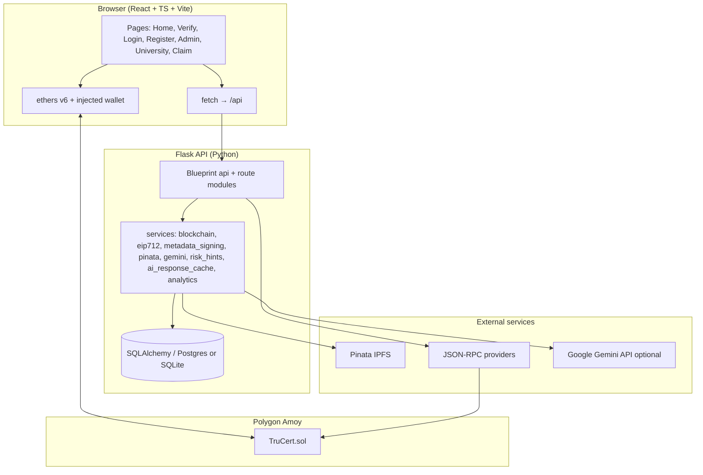
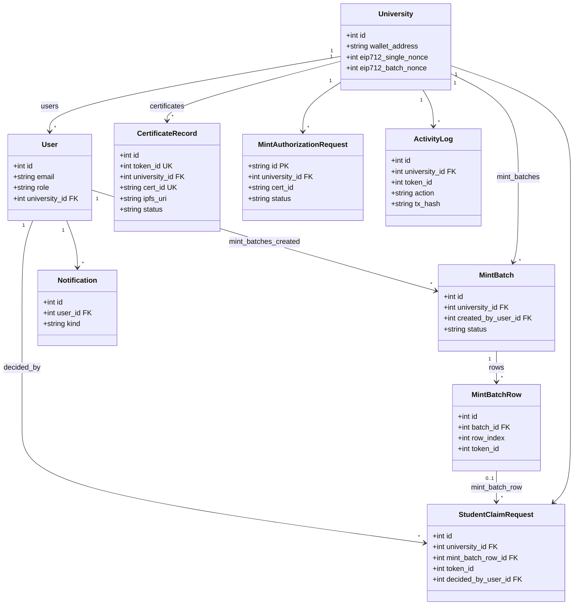

# TruCert — Blockchain Academic Credentials on Polygon Amoy

**COMP3901 Final Technical Report**

**Group:** [names]

**Date:** 2026-05-14

---

## Executive Summary

Academic credential fraud and fragmented verification motivate systems that bind issuer identity, credential content, and public auditability. **TruCert** is a capstone web application that issues digital certificates as **ERC-721** non-fungible tokens on **Polygon Amoy** (EVM testnet), with rich metadata on **IPFS** (Pinata) and a **Flask** backend for preparation, indexing, and analytics. **Universities never deposit private keys on the server**: they register a public issuer address, sign **EIP-712** authorizations for mints (single and batch) in the browser, and the platform **minter** hot wallet alone calls `mintForIssuer`. After minting, credentials live in **escrow** in the issuer wallet until **claim** locks them as **soulbound**; **revoke**, **burn**, and **reissue** are also **wallet-initiated** from the React university portal (`UniversityPage.tsx`), matching the smart contract’s access control.

What was built: a Solidity contract (`TruCert.sol`), Hardhat tooling and **seven** automated contract tests, a JWT-protected REST API (public verify routes without auth), CSV batch minting with one batch EIP-712 commitment, optional **Google Gemini** helpers (verify explanation, risk summaries) with in-process caching (`ai_response_cache.py`), and a **React + TypeScript + Vite** frontend using **ethers v6** and `fetch`.

Main limitations are environmental, not conceptual: **testnet** funds and RPC reliability, **IPFS** gateway and Pinata availability, and **server-held keys** for the platform minter, contract owner actions, and **Ed25519** metadata signing (`TRUCERT_SIG_*`) — the latter attests content integrity as the **platform**, not the university. Future work should address **mainnet** readiness (KMS/HSM for minter and signing keys), durable job queues for large batches, **HTTPS** metadata policies where institutions require it, stronger **LMS** integration, and exploration of **DID**-oriented issuer profiles while preserving the current clear separation between on-chain issuer address and off-chain presentation.

---

## 1. Introduction

### 1.1 Problem and importance

Paper credentials and informal PDFs are easy to misrepresent. Employers and third parties need a way to check that a credential was issued by a recognized institution, that its substantive fields have not been tampered with, and that it has not been superseded or revoked. Public blockchains offer a neutral place to anchor minimal facts (issuer, ownership, validity, content commitment) while keeping personal data off-chain where policy allows.

### 1.2 Objectives

The project’s objectives, as reflected in the repository, are to:

- Represent each certificate as an **ERC-721** token with **immutable issuer** metadata on-chain and **tokenURI** pointing to signed JSON.
- Keep **issuer EVM private keys** in the user’s wallet (MetaMask or compatible injected provider).
- Use a **platform minter** to pay gas for mints after **cryptographic authorization** (EIP-712) from the issuer.
- Support **batch issuance** from CSV with one issuer signature over a batch commitment.
- Provide **verification** APIs and UI for token id and field-based lookup.
- Index operational data in **SQLAlchemy** models for dashboards, notifications, and analytics.

### 1.3 Scope and non-goals

**In scope:** Amoy deployment, university and admin portals, public verify and claim flows, IPFS-backed metadata with Ed25519 platform signatures, optional Gemini-based explanations (clearly labeled as non-authoritative in the UI copy).

**Out of scope / non-goals:** Production mainnet deployment, custodial holding of university keys, a full email delivery implementation (README documents stub behavior unless SendGrid/SMTP is configured), formal legal accreditation workflows beyond admin approve/reject, and comprehensive mobile native apps.

### 1.4 Contributions

- A minimal **soulbound-after-claim** credential lifecycle on Solidity with explicit **revoke**, **burn**, and **reissue** paths.
- A **hybrid trust model**: EIP-712 for **issuer-authorized minting**; Ed25519 for **platform-signed metadata**; on-chain **whitelist** for issuer addresses.
- A working **full-stack reference implementation** with documented environment configuration (`backend/env.example.conf`, project `README.md`).

---

## 2. Background

### 2.1 EVM, MetaMask, and ERC-721

The **Ethereum Virtual Machine** executes deterministic smart contracts. **MetaMask** (or similar) injects `window.ethereum`, allowing the frontend to request chain changes, send transactions, and sign typed data. **ERC-721** defines non-fungible tokens with `ownerOf`, transfers, and optional `tokenURI` for metadata. TruCert extends OpenZeppelin’s `ERC721` + `ERC721URIStorage` and adds domain-specific state and hooks.

### 2.2 Polygon Amoy as development testnet

The Hardhat configuration defines a `polygonAmoy` network; the backend defaults EIP-712 chain id to **80002** (Amoy). Amoy provides cheap test **MATIC** for gas experiments; behavior approximates Polygon PoS tooling (e.g., **Geth POA middleware** in `blockchain_service.py` for extraData handling).

### 2.3 coreHash and commitments

Each credential’s substantive fields are hashed to a **core hash** (bytes32) stored on-chain in `coreHashOf`. Off-chain JSON mirrors display fields. EIP-712 **mint** and **batch** authorizations bind **commitments** derived from `cert_id` and `core_hash` (single row) or an aggregate over rows (batch), implemented in Python to match Solidity encoding conventions (`eip712_service.py`).

### 2.4 EIP-712 vs Ed25519 metadata signing

| Mechanism | Signer | Purpose in TruCert |
|-----------|--------|---------------------|
| **EIP-712** (`MintAuthorization`, `BatchMintAuthorization`) | University **issuer EVM wallet** | Authorize specific mint commitments and nonces; recovered address must match registered `wallet_address` and on-chain whitelist. |
| **Ed25519** (`metadata_signing.py`, `TRUCERT_SIG_*`) | **Platform** key material | Sign canonical JSON metadata pinned to IPFS; verifiers load public keys from `/api/public/config`. **Not** a university signature. |

### 2.5 IPFS / Pinata vs DB and HTTPS metadata

- **Primary path:** Metadata JSON is **pinned to IPFS** via Pinata (`pinata_service.py`); `tokenURI` is **`ipfs://…`** for new single mints and batch rows (per `README.md`).
- **Database:** `CertificateRecord` and related tables index `token_id`, `cert_id`, `core_hash`, status, and operational fields; **student email** and **internal id** on batch rows stay **DB-only** (not in pinned JSON).
- **Optional HTTPS metadata:** `PUBLIC_METADATA_BASE_URL` supports legacy HTTPS `tokenURI` alignment and public metadata routes where applicable (documented in `README.md`).

### 2.6 Related systems

- **Blockcerts-style stacks** historically combined anchoring and Merkle proofs with open verification; TruCert instead anchors **per-credential** NFT state and uses **EIP-712** for batch/single issuance authorization.
- **Pure IPFS credentials** without on-chain anchors lack a single global revocation/ownership story; TruCert uses **on-chain** `valid` and `locked`.
- **SBT (soulbound token) patterns** often mint non-transferable tokens directly; TruCert uses **escrow then claim** so the issuer wallet holds the token until the student supplies an address.

---

## 3. Method

### 3.1 System architecture

The system has three main interaction planes: browser ↔ API, browser ↔ wallet ↔ chain, and server ↔ chain / IPFS / optional LLM.

**C4-style context (concise):** The **university user** is a person using the browser; the **system** (TruCert) includes SPA + Flask + DB + workers implied by synchronous batch execute; **external systems** are MetaMask, RPC, Pinata, and optionally Gemini.

### 3.2 Architecture decomposition

| Layer | Responsibility |
|-------|------------------|
| **Presentation** | React Router pages, forms, charts (`recharts`), wallet connection helpers. |
| **API** | Flask blueprint `routes/api.py` with registered modules: `mint_batch_routes`, `student_claim_routes`, `admin_analytics_routes`, `university_analytics_routes`. |
| **Domain services** | Blockchain reads/writes, EIP-712 message construction and recovery, metadata canonicalization and Ed25519 signatures, Pinata uploads, optional Gemini calls with TTL caches. |
| **Persistence** | SQLAlchemy models (`models.py`), `ActivityLog` ingestion from chain events where implemented. |
| **On-chain** | `TruCert.sol` — whitelist, minter role, mint, claim, revoke, burn, reissue. |

### 3.3 Trust boundaries

- **Issuer EVM private keys** never leave the browser; Flask endpoints prepare typed data and accept **signatures**, not secrets.
- **Platform minter** private key (`TRUCERT_MINTER_PRIVATE_KEY`) can only invoke `mintForIssuer` and is constrained by **whitelist** and **NotMinter** checks.
- **Contract owner** key (`CONTRACT_OWNER_PRIVATE_KEY`) is for **admin** chain actions such as whitelist updates — separate from universities.
- **Claim / revoke / burn / reissue:** Implemented in `UniversityPage.tsx` by building a contract instance and calling `claim`, `revokeCertificate`, `burnCertificate`, and `revokeAndReissue` with the **connected issuer wallet** (after optional `prepare-reissue` API for metadata). Flask does **not** submit these as the issuer.
- **Ed25519** keys attest metadata bytes as **TruCert platform** content, disclosed via `/api/public/config` public keys — verifiers must understand this is **not** a substitute for EIP-712 issuer authorization of mints.

### 3.4 Tradeoffs

- **Polygon (Amoy):** Low-cost experimentation; testnet faucets and RPC limits are operational pain points.
- **Soulbound after claim:** Preserves transfer for issuer → student escrow, then prevents secondary markets for the credential token — a product choice with UX implications (lost wallet = lost NFT).
- **Platform minter:** Universities avoid gas for mints but must trust the platform to mint **only** after valid EIP-712 verification (and to protect the minter key).
- **EIP-712 batch authorization:** One signature amortizes user effort over many rows; commitment construction is order-independent for row multiset (`batch_mint_commitment`).
- **Minimal on-chain state:** Rich display stays off-chain; chain stores commitments and lifecycle flags — cheaper but verifier must fetch metadata.

### 3.5 Smart contract summary (`contracts/TruCert.sol`)

**State variables (high level):** `nextTokenId`; mappings `issuerOf`, `coreHashOf`, `locked`, `valid`, `whitelistedIssuers`; `minter` address; custom errors `Soulbound`, `NotWhitelistedIssuer`, `InvalidToken`, `NotIssuer`, `NotMinter`.

**Main functions:**

- `setIssuerWhitelisted`, `setMinter` — `onlyOwner`.
- `mintForIssuer(issuer, uri, coreHash, certId)` — **only `minter`**; mints to **issuer**; sets `issuerOf`, `coreHashOf`, `valid=true`, `locked=false`.
- `claim(tokenId, student)` — **current owner** (issuer while escrowed) transfers to student, sets `locked=true`.
- `revokeCertificate` — **only `issuerOf[tokenId]`** sets `valid=false`.
- `burnCertificate` — **issuer only**, requires `valid==false`, then `_burn`.
- `revokeAndReissue` — **issuer**: invalidates old token, mints new token to issuer with new URI/hash/cert id.

**`_update` override:** On transfers (`from` and `to` non-zero), reverts if `!valid[tokenId]` or `locked[tokenId]` — enforcing no transfers when invalid or soulbound.

### 3.6 Backend summary

**Flask entry:** `create_app` in `backend/app/__init__.py` loads configuration, initializes SQLAlchemy and JWT, registers CORS behavior for `/api`, registers the `api` blueprint, and runs lightweight migrations plus optional admin bootstrap.

**Primary modules:**

| Module | Role |
|--------|------|
| `routes/api.py` | Auth, admin university approve/reject, university profile and mint/reissue prepare/submit, verify endpoints, notifications, public config, optional Gemini test route, etc. |
| `mint_batch_routes.py` | CSV upload, per-row prepare, batch EIP-712, submit authorization, chunked execute, export errors. |
| `student_claim_routes.py` | Public student claim request submission; university approve/reject/complete. |
| `admin_analytics_routes.py` / `university_analytics_routes.py` | Aggregates and dashboards. |

**Services:**

| Service | Role |
|---------|------|
| `blockchain_service.py` | Web3 connection with RPC fallbacks and POA middleware; `mint_for_issuer`; owner whitelist txs; **windowed `get_logs`** to avoid RPC block-range errors when reconciling minted token ids. |
| `eip712_service.py` | Commitment hashing; `mint_authorization_full_message` and `batch_mint_authorization_full_message`; digest and signer recovery. |
| `metadata_signing.py` | Canonical JSON + **Ed25519** sign/verify; export public keys for config. |
| `pinata_service.py` | Pin JSON and images to IPFS. |
| `gemini_service.py` | Optional LLM calls (verify explain, risk hints) with graceful degradation if unset. |
| `risk_hints_service.py` | Operational risk-style hints for admin/university dashboards. |
| `ai_response_cache.py` | In-process TTL cache for Gemini responses (thread-safe store; documented swap path to Redis in module docstring). |
| `analytics_service.py` | DB-backed aggregates including `global_mint_time_percentiles()` for public timing bands. |

### 3.7 ORM class diagram (`backend/app/models.py`)

### 3.8 Batch EIP-712 commitment (technical)

Per `eip712_service.py` (and `README.md`):

- **Row commitment:** `keccak256(abi.encode(certId, coreHash))` with `coreHash` as 32 bytes — matches Solidity `abi.encode` semantics via `eth_abi.encode` in Python.
- **Batch commitment:** `inner = keccak256(abi.encodePacked(sorted row_commitments))`; `commitment = keccak256(abi.encode(uint256 batchId, inner))`. Sorting makes the batch commitment **order-independent** over rows.
- **Typed data:** `BatchMintAuthorization` binds `issuer`, `batchId`, `commitment`, `nonce`, `expiry` under the EIP-712 domain (`name`, `version`, `chainId`, `verifyingContract`).

The database stores `eip712_single_nonce` and `eip712_batch_nonce` on `University` so single-mint and batch authorizations do not invalidate each other’s replay windows (`models.py`, migrations in `__init__.py`).

### 3.9 Frontend stack

- **React 18**, **TypeScript**, **Vite 5**, **react-router-dom v6**.
- **ethers v6** for ABI, providers, and contract calls.
- **fetch** via `apiJson` / `apiFormData` in `frontend/src/api/client.ts` — **no axios, Redux, or Zustand** in `package.json`.
- **Routes** (from `App.tsx`): `/`, `/verify`, `/login`, `/register`, `/admin`, `/university`, `/claim`, plus nested admin/university hub paths as implemented.

### 3.10 Security

- **JWT RBAC:** Access tokens embed role claims; `_require_roles` guards admin vs university routes (`api.py`).
- **Nonce and expiry:** EIP-712 messages include `nonce` and `expiry`; successful authorization advances the appropriate university nonce field.
- **Whitelist:** On-chain `whitelistedIssuers` must be true for the recovered issuer before mint; admin approval path triggers owner actions (`README.md`).
- **Metadata signature verification:** `verify_metadata_signature` checks `trucert_sig_alg == "ed25519"`, known `kid`, and Ed25519 signature over canonical JSON without signature fields (`metadata_signing.py`). Verification flows combine chain state, indexed DB, and this metadata check as implemented in `api.py`.

### 3.11 Challenges (grounded in repository docs and code)

- **RPC / `get_logs`:** `blockchain_service._safe_event_logs` retries with shrinking block windows when providers enforce range limits; scans are clamped (`RECONCILE_SCAN_BLOCKS` / window logic) to reduce load (`blockchain_service.py`).
- **Gas / faucet:** README points to Amoy MATIC faucet; `blockchain_service` sets elevated priority fees on Amoy (comment notes minimum tip behavior).
- **Wallet UX:** Issuers must match registered address, switch to Amoy, and confirm multiple lifecycle transactions — documented as wallet-only flows.
- **Vite proxy / API reachability:** `vite.config.ts` proxies `/api` to `http://127.0.0.1:5000`. `client.ts` documents that without the dev proxy or `VITE_API_BASE`, `/api` calls can fail (404 / connection issues) — typical when Flask is not running on port 5000.
- **Database:** README recommends Neon Postgres with `sslmode=require`; fallback SQLite for local dev. DNS or SSL misconfiguration for hosted DBs is a common deployment issue class (called out generically here as Neon/hosted Postgres operations).

### 3.12 Testing

**Hardhat contract tests** (`test/TruCert.js`): **7** tests, all passing in a healthy environment (`npx hardhat test`).

| # | Test name (paraphrased) | What it covers |
|---|-------------------------|----------------|
| 1 | Minter mints for whitelisted issuer | `mintForIssuer` succeeds; NFT in issuer wallet; `issuerOf` and `locked==false`. |
| 2 | Global token ids, claim, soulbound | `claim` transfers to student; `locked==true`; `transferFrom` reverts. |
| 3 | Revoke blocks transfers | After revoke, `valid==false`; student cannot transfer. |
| 4 | Burn revoked issuer-only | Non-issuer burn reverts; issuer burn after revoke succeeds; `ownerOf` reverts. |
| 5 | Reissue | `revokeAndReissue` marks old invalid, mints new token to issuer with new validity. |
| 6 | Minter cannot mint non-whitelisted | `NotWhitelistedIssuer` custom error. |
| 7 | Non-minter cannot mint | `NotMinter` for arbitrary and issuer callers. |

**Manual E2E:** `README.md` describes end-to-end operation: deploy contract, configure `.env`, run backend and frontend, register university, admin approve, single mint, batch mint, verify — **7/7** Hardhat tests complement but do not replace this.

### 3.13 Scalability and expansion

- **Job queue:** Today batch execute performs sequential mints in-request; a worker queue would improve tail latency and timeouts for large cohorts.
- **KMS/HSM:** Protect `TRUCERT_MINTER_PRIVATE_KEY`, `CONTRACT_OWNER_PRIVATE_KEY`, and `TRUCERT_SIG_PRIVATE_KEY` beyond environment variables.
- **Mainnet:** Requires economic design for gas, legal review, and Pinata/production IPFS strategy.
- **HTTPS metadata:** Some enterprises require TLS fetchability without IPFS gateways; `PUBLIC_METADATA_BASE_URL` path exists for legacy alignment.
- **LMS / DID:** LMS integration for roster ingest and DID methods for issuer discovery are natural extensions outside current scope.

---

## 4. Results

### 4.1 Objectives vs evidence

| Objective | Evidence in repository |
|-----------|-------------------------|
| ERC-721 credentials with lifecycle | `contracts/TruCert.sol`; OpenZeppelin extensions |
| Issuer keys not on server | `README.md`; `UniversityPage.tsx` wallet calls; API prepares typed data only |
| Gasless mint authorization | EIP-712 in `eip712_service.py`; submit routes in `api.py` / `mint_batch_routes.py` |
| Batch CSV issuance | `mint_batch_routes.py`, `MintBatch` / `MintBatchRow` models |
| Public verification | `GET /api/verify/<token_id>`, `VerifyPage.tsx` |
| Contract correctness baseline | `test/TruCert.js` — **7/7** tests |
| Optional AI helpers | `gemini_service.py`, `ai_response_cache.py`, verify/risk UI disclaimers |

### 4.2 Metrics

- **Mint timing percentiles:** Implemented in `analytics_service.global_mint_time_percentiles()` and exposed publicly at **`GET /api/public/mint-time-insights`** (`api.py`). The JSON includes sample sizes `n` and `p50_ms` / `p90_ms` for `single_mint_platform`, `batch_row_platform`, and `execute_chunk_wall` when the app has collected data — **report numbers from a live deployment** rather than inventing them here.

### 4.3 Figure placeholders (insert screenshots when exporting)

- **Figure 1 — Verify by token id:** Public verification for a known Amoy token; show validity, issuer, and metadata signature status.
- **Figure 2 — Batch completed:** University batch mint UI showing authorized batch and executed rows.
- **Figure 3 — Admin approve:** Admin approval of a pending university registration / whitelist action outcome.

See `docs/figures/README.md` for a fuller capture checklist.

---

## 5. Conclusions

TruCert meets the original problem framing for a **course-scale** system: cryptographic binding between institutions, credentials, and a public audit trail, with a pragmatic split between **issuer-signed mint policy** (EIP-712) and **platform-signed presentation metadata** (Ed25519). The largest architectural bet — **platform minter** — trades university gas costs for centralized key custody that must be hardened for production.

**What we would do differently with hindsight:** introduce an asynchronous mint worker earlier to avoid long HTTP requests on large batches; add richer automated integration tests beyond Solidity unit tests; and standardize operational runbooks for RPC provider failover.

**Lessons learned:** wallet UX dominates perceived reliability; EIP-712 nonce discipline must be explicit across single vs batch flows; IPFS gateways affect verifier UX as much as chain RPC.

**Extensions:** mainnet, KMS, queue-based minting, enterprise metadata hosting, and deeper student identity practices (DID, selective disclosure) while preserving the current trust story.

---

## Appendix A. Configuration and secrets

- **Environment template:** `backend/env.example.conf` — copy to `.env` locally; **do not commit** filled secrets.
- **Key paths:** `contracts/TruCert.sol`, `test/TruCert.js`, `backend/app/`, `frontend/src/`, `README.md`, `hardhat.config.js`, `scripts/deploy.js`.
- **Do not commit:** `.env` files, real `PINATA_JWT`, `GEMINI_API_KEY`, private keys (`TRUCERT_MINTER_PRIVATE_KEY`, `CONTRACT_OWNER_PRIVATE_KEY`, `DEPLOYER_PRIVATE_KEY`, `TRUCERT_SIG_PRIVATE_KEY`), or production database URLs in public repos.

---

## Appendix B. Contract interface reference (frontend)

The TypeScript ABI mirror in `frontend/src/abi/trucertAbi.ts` includes `mintForIssuer`, `claim`, `revokeCertificate`, `burnCertificate`, and `revokeAndReissue` — consistent with `TruCert.sol` for wallet-side calls.

---

*End of report.*
